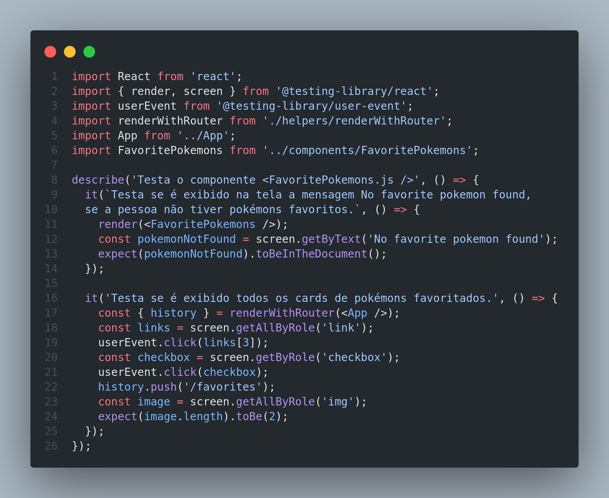

# Trybe Project React Testing Library 02/10/2021
 

  
  

 

## Habilidades

- Utilizar os seletores (queries) da React-Testing-Library em testes automatizados;
- Simular eventos com a React-Testing-Library em testes automatizados;
- Testar fluxos lógicos assíncronos com a React-Testing-Library;
- Escrever testes que permitam a refatoração da estrutura dos componentes da aplicação sem necessidade de serem alterados;
- Criar mocks de APIs utilizando fetch;
- Testar inputs.

## Desenvolvimento
Testes automatizados com React-Testing-Library.

## Resultados

- `2` dias de projeto;
- `7` requisitos;
- Percentual de cumprimento de requisitos obrigatórios `85.71%`;
- Percentual de cumprimento de requisitos totais `85.71%`.
